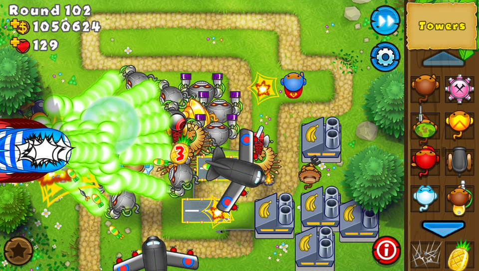
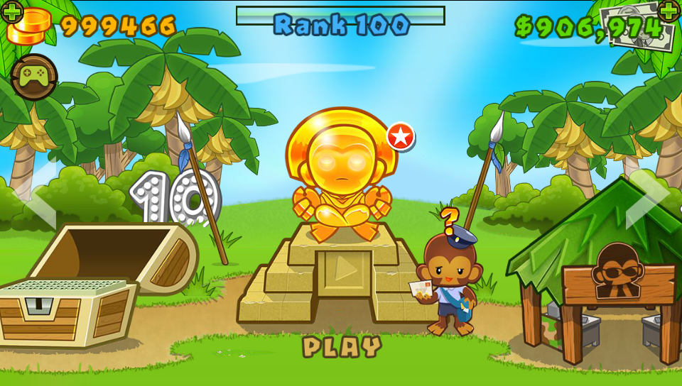
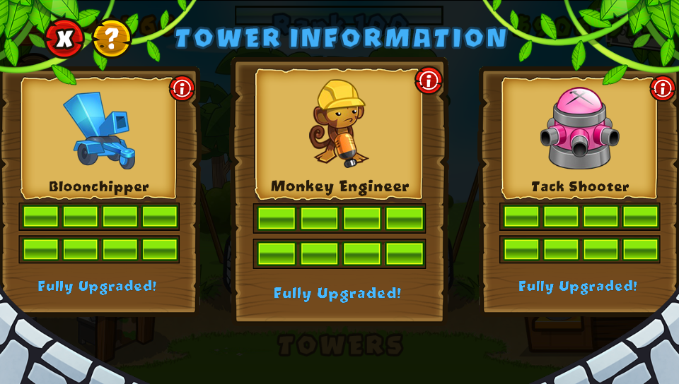
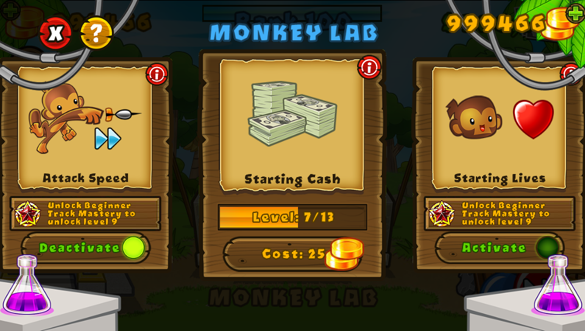

# Bloons TD 5 Vita

An unofficial PlayStation Vita loader for the Android ARMv7 release of
**Bloons TD 5**.

**Current release: v1.00**

## Support

If this port or the related Vita work is useful to you, you can
[support future development on Buy Me a Coffee](https://buymeacoffee.com/lootfury).

> [!IMPORTANT]
> This repository and its VPK do not contain the game executable, APK, or game
> data. You must legally own a supported Android release and prepare its files
> yourself.

## Features

- Boots the pinned Android ARMv7 builds of BTD5 3.37 and 4.7.
- Automatically boots the only installed version or shows a version picker
  when both data folders are present.
- Reimplements the Android lifecycle, JNI, Bionic/POSIX, asset, EGL, input,
  file, time, and audio services used by the game.
- Supports music and sound effects through Vita audio.
- Provides front-touch input and a Vita-controlled virtual cursor.
- Saves the game's completed `Profile.save` transactions and performs a clean
  save on supported shutdown paths.
- Includes an optional Low Graphics mode focused on runtime efficiency without
  substituting incompatible texture atlases or lowering the display resolution.
- Replaces `loader.log` on each boot and records performance, audio, save, and
  crash diagnostics.

## Screenshots

| Late-round gameplay | Main menu |
|---|---|
|  |  |
| **Tower information** | **Monkey Lab** |
|  |  |

## Known limitations

- Extreme sandbox rounds can remain CPU-bound. Low Graphics reduces loader and
  rendering overhead, but it cannot move the game's simulation to the GPU or
  guarantee 60 FPS in every late-round setup.
- Android storefront, advertising, cloud, social, and live-event integrations
  are unavailable.
- Online functionality is not supported.
- Only the exact APK fingerprints documented below are release targets. Modded,
  ARM64, truncated, or mixed-version game files are rejected.

## Vita requirements

- [`kubridge.skprx`](https://github.com/bythos14/kubridge).
- `libshacccg.suprx`, normally installed with
  [ShaRKBR33D](https://github.com/OsirizX/ShaRKBR33D).


Each installed game version must retain its owned source APK under the exact
name `base.apk`. For BTD5 4.7, use the APK containing the game assets as
`base.apk`; obtain `libnative.so` from the separate ARMv7 APK when necessary.


### BTD5 3.37

The supported vanilla APK has this SHA-256:

```text
b5f6f341bb9918333a5ecbdb5af4a6026beb58bab33986546673c3ab00993639
```

Create `ux0:data/btd5/3.37/`, then:

1. Copy the owned APK into the `3.37/` folder and name it `base.apk`.
2. copy the complete `assets/` directory into the `3.37/` folder.
3. Extract `lib/armeabi-v7a/libnative.so` and place it directly inside the
   `3.37/` folder as `libnative.so`.

The loader verifies the extracted native executable before starting the game.

### BTD5 4.7

This release supports the original ARMv7 APK set. The filenames supplied by
different installers and backup tools may vary.

Create `ux0:data/btd5/4.7/`, then:

1. Copy the owned APK containing the game assets into the `4.7/` folder and
   name it `base.apk`.
2. copy its complete `assets/` directory into the `4.7/` folder.
3. From the owned ARMv7 APK containing the native library, extract
   `lib/armeabi-v7a/libnative.so` and place it directly inside the `4.7/`
   folder as `libnative.so`.

Do not use an ARM64 native library; the Vita loader requires ARMv7.

### Final data layout

Install either version folder or both:

```text
ux0:data/btd5/
├── 3.37/
│   ├── assets/
│   ├── base.apk
│   └── libnative.so
└── 4.7/
    ├── assets/
    ├── base.apk
    └── libnative.so
```

Do not mix one version's `libnative.so` with another version's assets.

## Controls

| Vita input | Action |
|---|---|
| Left or right stick | Move the virtual cursor |
| Cross | Tap; hold while moving to drag or place a tower |
| R | Hold the virtual finger for dragging, map panning, and sliders |
| Circle | Cancel an active placement; otherwise use Android Back |
| Start | Open the contextual pause/back action |
| Hold Start for 1.5 seconds | Save and cleanly exit |
| L | Precision cursor movement while held |
| Triangle | Recenter the cursor |
| Select while Settings is open | Toggle Low Graphics for the next launch |
| Front touchscreen | Native touch input |

The virtual cursor disappears after five seconds without cursor input and
returns when it is moved or activated.

## Low Graphics

Open the game's Settings screen from the main menu or an active game, then
press Select. The loader-owned tile shows the saved state and indicates when a
restart is required.

Low Graphics keeps the stable 960×544 output and the correct BTD5 texture/XML
atlas pairing. It enables the lower-overhead shader policy and other safe
loader-side optimizations. It deliberately avoids the experimental resolution
and atlas substitutions that caused black screens or scattered UI.

## Building from source

The project requires
[VitaSDK-softfp](https://github.com/vitasdk-softfp),
VitaGL, vitashark, kubridge, and soft-float builds of the pinned audio and
compression dependencies required for Android ARMv7 ABI compatibility.

Run these commands from the repository root:

```bash
export VITASDK=/path/to/vitasdk-softfp
export PATH="$VITASDK/bin:$PATH"

cmake -S . -B build \
  -DCMAKE_TOOLCHAIN_FILE="$VITASDK/share/vita.toolchain.cmake" \
  -DCMAKE_BUILD_TYPE=Release

cmake --build build -j"$(nproc)"

find build -type f \( \
  -name "*.vpk" -o \
  -name "eboot.bin" -o \
  -name "param.sfo" \
\)
```

The release package is generated as `build/btd5-vita.vpk`. It contains only
the Vita loader and LiveArea resources.

## Diagnostics

The newest session log is written to:

```text
ux0:data/btd5/loader.log
```

The file is replaced on every launch, so it does not grow indefinitely. Copy
it to your computer before launching again if you need to preserve a failed
session.

Core dumps can be inspected with `vita-parse-core`. When reporting a problem,
include the BTD5 data version, the newest `loader.log`, and the matching core
dump if one was generated. Never attach APKs or extracted game assets.

## Repository layout

```text
extras/      LiveArea resources, packaged files, and screenshots
lib/         Vendored loader, JNI, filesystem, and bridge components
source/      BTD5 loader and Android compatibility implementation
tests/       Host-side diagnostic-tool tests
```

Generated dependencies, build output, APKs, saves, logs, dumps, and extracted
game data are excluded by `.gitignore`.


## Credits

- [SoLoader Boilerplate](https://github.com/v-atamanenko/soloader-boilerplate)
  by Volodymyr Atamanenko and contributors.
- [FalsoJNI](https://github.com/v-atamanenko/FalsoJNI) by Volodymyr Atamanenko.
- [`so_util`](https://github.com/TheOfficialFloW/so_util) by TheFloW and
  contributors.
- [VitaGL](https://github.com/Rinnegatamante/vitaGL) by Rinnegatamante and
  contributors.

See [THIRD_PARTY.md](THIRD_PARTY.md) for dependency and vendoring notes.

## Legal

This is an unofficial homebrew project and is not affiliated with or endorsed
by Ninja Kiwi. Bloons TD 5, its name, characters, artwork, and game data are
property of their respective owners. No game executable or gameplay assets may
be submitted to this repository.

The loader source is distributed under the [MIT License](LICENSE). Third-party
components retain their original copyright notices and licenses.
